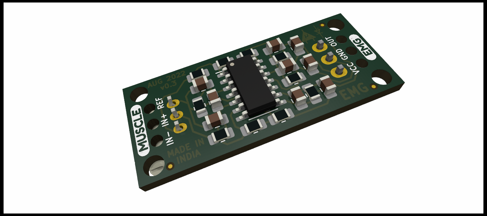
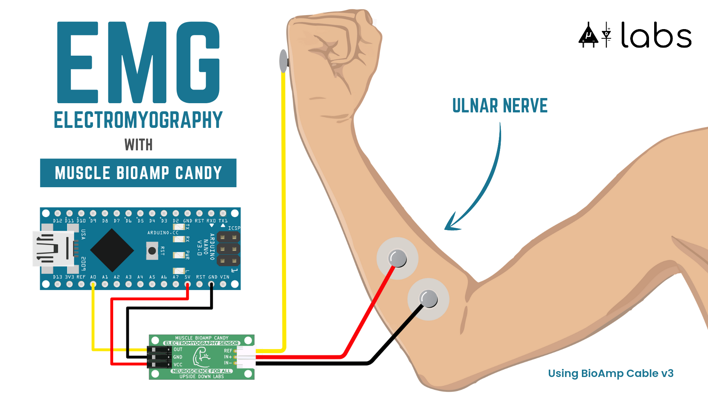
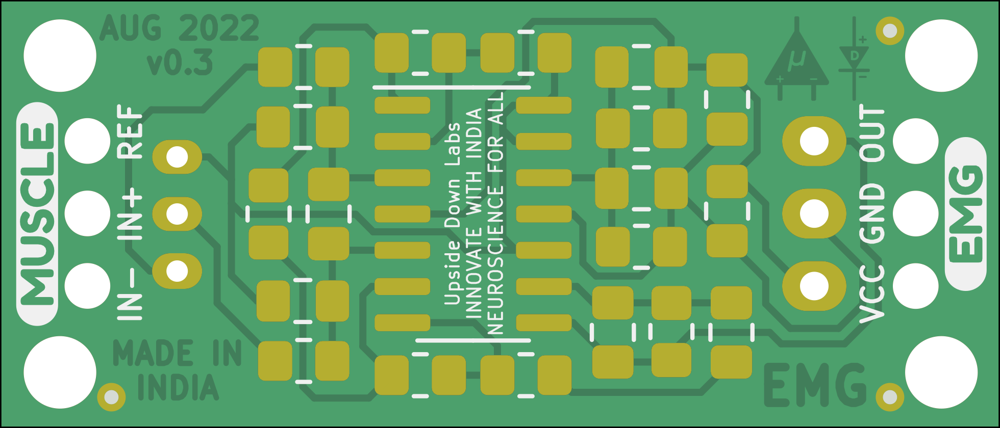
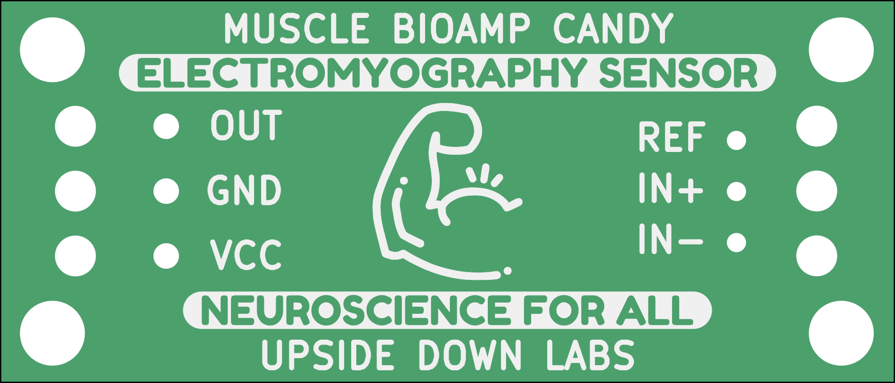
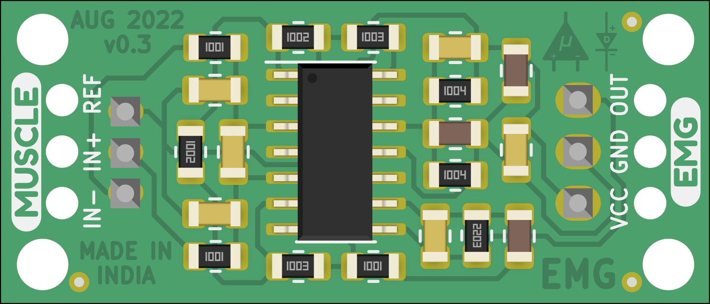
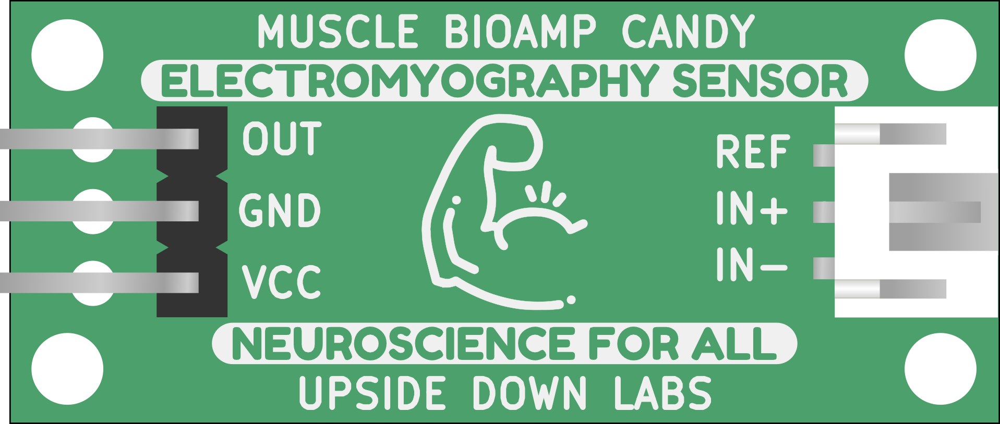
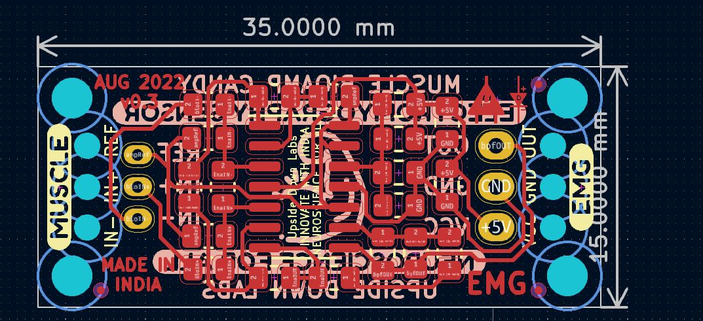
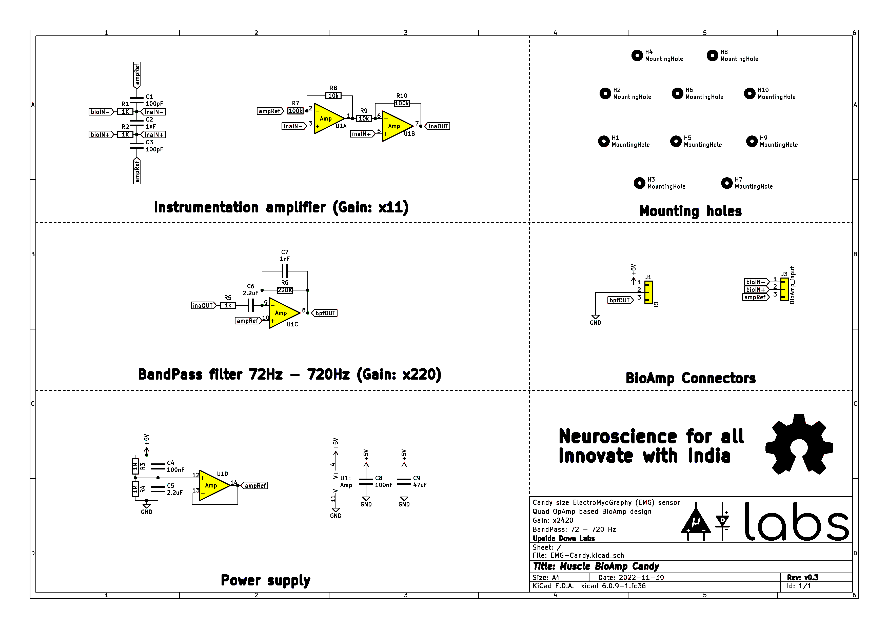

# Muscle-BioAmp-Candy

 

[-white)](https://store.upsidedownlabs.tech/product/muscle-bioamp-candy/)

 
 

A candy size ElectroMyography (EMG) sensor for precise muscle bio-potential signals recording at an affordable cost. It comes with a fixed gain of x2420 and BandPass filter of 72Hz - 720Hz. To record the EMG signals you can use any standalone ADC like ADS1115 or any microcontroller development board with an ADC of your choice like Arduino UNO/Nano.

## Hardware

Muscle BioAmp Candy has been created using KiCad and all the design files can be found under [hardware](hardware/) folder. Images below shows a quick overview of the hardware design.

| PCB Front           |  PCB Back |
| :-------------------------: | :-------------------------: |
|   |  |

## License

| Licenses Facts              |  OSHWA Certification |
| :-------------------------: | :-------------------------: |
|   |  | 

#### Hardware
CERN Open Hardware License Version 2 - Strongly Reciprocal ([CERN-OHL-S-2.0](https://spdx.org/licenses/CERN-OHL-S-2.0.html)).

#### Software
MIT open source [license](http://opensource.org/licenses/MIT).

#### Documentation:
 This work is licensed under a <a rel="license" href="http://creativecommons.org/licenses/by/4.0/">Creative Commons Attribution 4.0 International License</a>.
